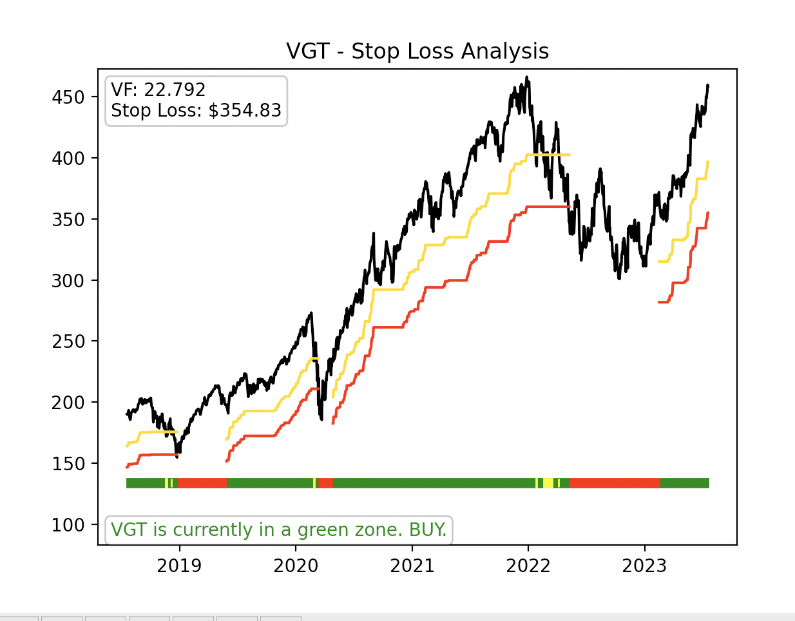
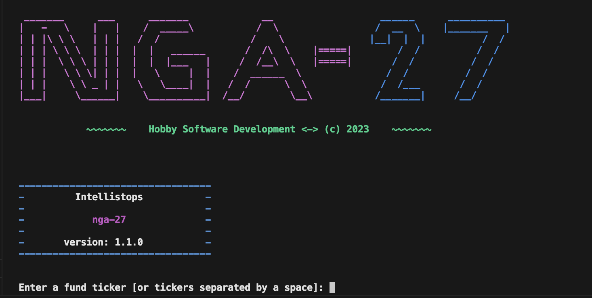

# intellistop

Library tool to determine a smart stop-loss for technical analysis of funds. This utilizes the ***[Volatility Factor (VF)](#vf)***.




---

# What is Intellistop?

Intellistop is a tool that derives some mathematical features of a fund's price that can help an investor better understand when to **buy** and **sell** a particular equity.

First, the obvious disclaimer: ***the Intellistop tool and its author are not liable for any personal investing performance***. After all, there are a myriad of tools out there that can help an investor make investing decisions, and all of them basically say the same thing - _you're on your own_.

Now, back to the tool...

The tool centers around two philosophies:

* Stop losses should be used to protect gains and assets, and
* Price action remains within a factor of volatility _unless_ a major change to the trend occurs.

Fellow Technical Analysts or Quants might deduce from the above that if an equity drops beyond its normal volatility range, then a larger change in trend might be starting. Since it's a drop, it might signal the start of a larger downward trend. If this conjecture is reasonable, then it would also be reasonable to suggest that the stop loss value should be somehow related to this normal volatility range.

So... If there was a way to derive the correct normal volatility factor of a given equity, then it be possible to set a stop loss that would balance the benefit letting an equity have room to move around in a normal capacity with the protection of avoiding large losses on a larger downward trend. In this same vein, this similar method would be able suggest when a larger downward trend is ending and when it's a good time to re-enter a trade.

This conjecture, at its heart, is the main function of **Intellistops**.

Intellistops generates a [_volatility factor_](#vf) (VF) that is used to derive both a _stop loss for upward-trending equities_ and a _re-entry signal after a downward trend concludes_.

---

# Installation

To run the `IntelliStop` library as an import [in something else], simply run pip install as you normally would:

```sh
pip install .

# For MacOS / or zsh
pip install '.'
```

To run the standalone program, the one that will generate a plot image with a requested input ticker, install the additional `app` installations. (This primarily includes `matplotlib`):

```sh
pip install .[app]

# For MacOS / or zsh
pip install '.[app]'
```

---

# Importing Class or Running the App

This tool can be imported as a library class or run as a standalone app in the terminal.

To run as a library import:

```python
from intellistop import Intellistop

stops = IntelliStop()
vf_data, has_error = stops.run_analysis_for_ticker(ticker_str)
```

Note: as of `1.1.0`, `has_error` has been added as a tuple output of the main function. This is helpful for better handling of errors in one's application more gracefully.

You may also use the following subfunctions for your benefit as well:

```python
from intellistop import Intellistop

stops = IntelliStop()
vf_data, has_error = stops.run_analysis_for_ticker(ticker_str)

# Default is to only return 'Close' data
close = stops.return_data(fund)

# Optionally can pass in the exact key (see details of function)
dates = stops.return_data(fund, key='__full__').get('Date', [])
```

Full documentation of features of `IntelliStop` is available in the **[API Docs](./static/api.md)**.

---

### `use_memory` Input Argument for "Conservative" Stops

Optionally, as of version `1.2.0`, you can pass a boolean to the optional field of `use_memory` to `stops = IntelliStop()`. This is shown below:

```python
from intellistop import Intellistop

stops = IntelliStop(use_memory=True)
vf_data, has_error = stops.run_analysis_for_ticker(ticker_str)

# Default is to only return 'Close' data
close = stops.return_data(fund)

# Optionally can pass in the exact key (see details of function)
dates = stops.return_data(fund, key='__full__').get('Date', [])
```

[Full details on historical data creating a more conservative VF and stop loss.](./static/historical_vf.md)

---

### Standalone App

To run as the standalone app, simply run in terminal:

```sh
python app.py
```

Then, enter the ticker symbol [or symbols separated by a space each] of the equity/equities desired:



---

# Entry Signal Triggers

1. An equity's price must rise more than 1 Volatility Factor (**VF**) from its lowest bottom since it hit the red/stop zone
2. _Slope_ of the "intelligent moving average" (the equity's trend line) must rise above a specific threshold

The second of these triggers is derived from a Intelligent Moving Average, or IMA.

## Intelligent Moving Average (IMA)

### Algorithm

Using the "created" IMA, we'll look at a few conditions. Our targeted **BUY** signal is after the following 5 conditions are achieved:

1. Price rides 1 VF (%) above bottom / minimum
2. Price rides above the IMA
3. $SMA_{15}[Slope[IMA[k]]] > 0$
4. $SMA_{50}[Slope(IMA[k]]] > 0$
5. $SMA_{15} > SMA_{50}$

# <a name="vf"></a>Volatility Factor (VF)

Now it's math time. How is the Volatility Factor (VF) calculated?

[The Whitepaper](./static/volatility_factor.md)
