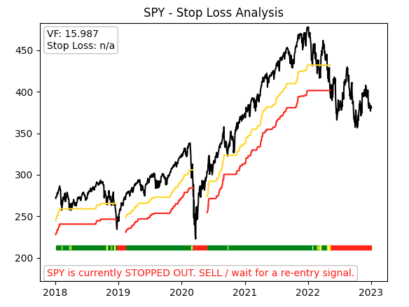

# intellistop

Library tool to determine a smart stop-loss for technical analysis of funds. This utilizes the ***[Volatility Factor (VF)](#vf)***.

---

# What is Intellistop?

---

# Installation

To run the `IntelliStop` library as an import [in something else], simply run pip install as you normally would:

`pip install .` (or `pip install '.'` for MacOS)

To run the standalone program, the one that will generate a plot image with a requested input ticker, install the additional `app` installations. (This primarily includes `matplotlib`):

`pip install .[app]` (or `pip install '.[app]'` for MacOS)

# Entry Signal Triggers

1. Security's price must rise more than 1 VQ from its lowest bottom since it hit the red/stop zone
2. _Slope_ of the "smart moving average" (their trendline) must rise above a specific threshold

(VQ may only need about a year's worth of data to compute, according to docs.)

## Smart Moving Average (SmMA)

### Algorithm

Using the "created" SmMA, we'll look at a few conditions. Our targeted **BUY** signal is after the following 4 conditions are achieved:

1. Price rides 1 VQ (%) above bottom / minimum
2. Price rides above the SmMA
3. SMA-15(Slope(SmMA[k])) > 0
4. SMA-50(Slope(SmMA[k])) > 0
5. SMA-15 > SMA-50

### Prospective algorithm

1. Calculate VQ
2. Fetch larger data set.
3. Set extrema mask percent (threshold between local maxima and minima, some % of VQ).
4. Generate list of extrema points.
5. Iteratively determine what period of SmMA fits the extrema criteria the best (with the lowest overall variance)
6. Find the Green-Yellow-Red zones of a fund

# Volatility Factor (VF)

# Other Links

* [Tradesmith bootcamps](https://tradesmith.zendesk.com/hc/en-us/sections/5551499479956-TradeSmith-Bootcamp-Beginner-Lessons)
* [Smart Moving Average (SmMA)](https://tradestops.com/blog/when-to-get-back-in/#:~:text=The%20Smart%20Moving%20Average%20tells,a%20bottom%20is%20in%20place.)